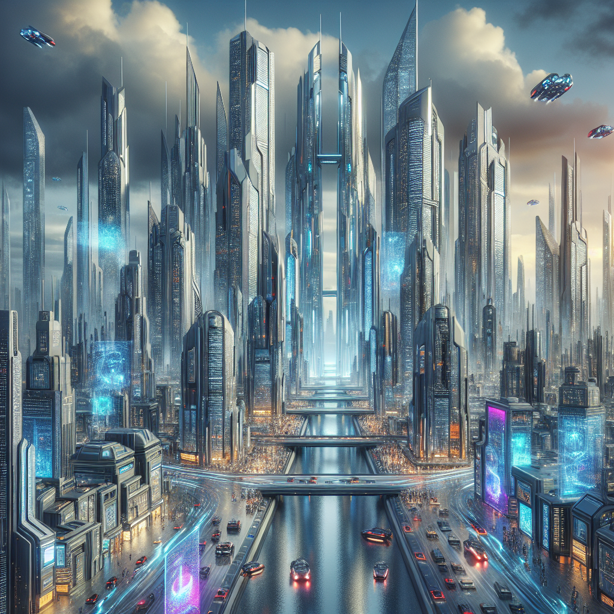
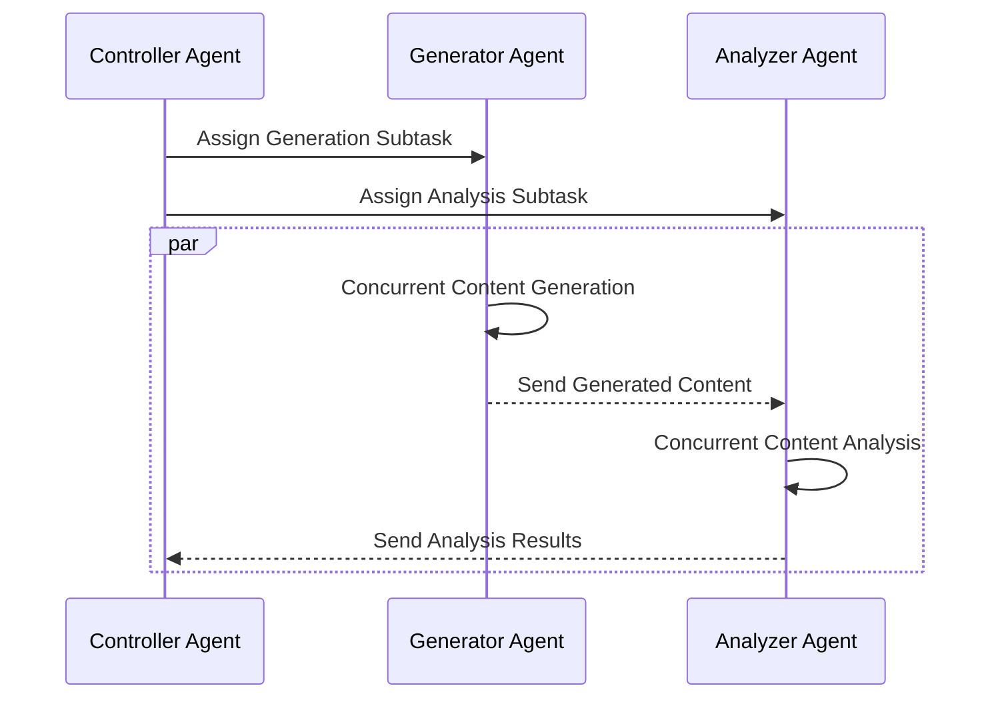
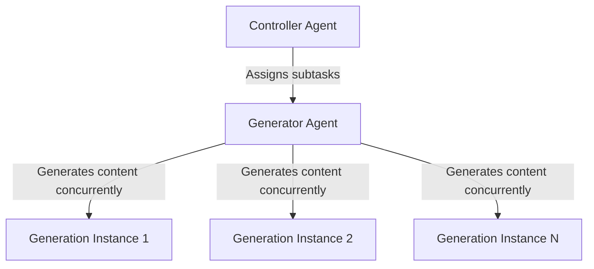
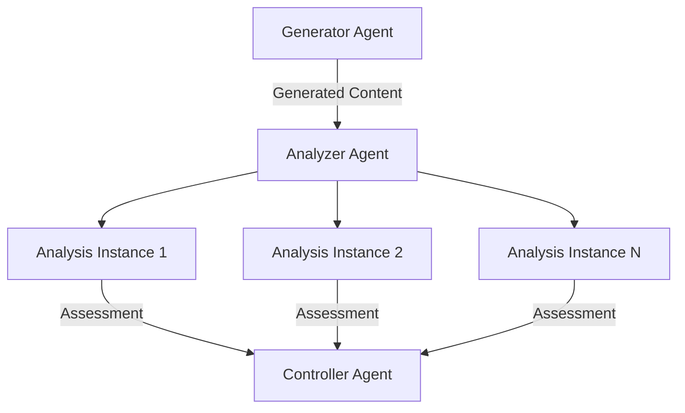
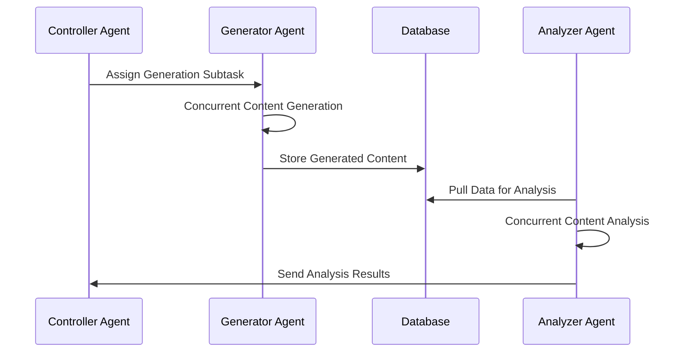

# Concurrent Generative-Analytic Swarms: A Hierarchical Agent-Based Approach for Efficient Multi-Modal Synthesis and Assessment

The implementation of: ``**Harnessing Hierarchical Swarms: A Groundbreaking Approach to Multi-Modal Content Creation''**. https://medium.com/@arash.mansoori65/harnessing-hierarchical-swarms-a-groundbreaking-approach-to-multi-modal-content-creation-061dbcb698f6



## Description

The proposed method introduces a novel framework for a hierarchical swarm of agents designed to tackle composite tasks with high concurrency and efficiency. The framework comprises three specialized agents: the Controller Agent, the Generator Agent, and the Analyzer Agent, each fulfilling distinctive roles within task decomposition, content generation, and content analysis.

### Agent Interaction Model
The Controller Agent lies at the apex of the hierarchy and is responsible for decomposing composite tasks into two parallel subtasks. One subtask targets content generation, managed by the Generator Agent, while the other concerns content analysis, overseen by the Analyzer Agent. The diagram below illustrates the agent interactions according to the established workflow.



### Concurrent Generation and Analysis Process
This section expounds on the concurrent content generation and analysis processes to highlight their saliency in achieving high throughput and real-time task execution.

#### Concurrent Content Generation
Following task assignment, the Generator Agent simultaneously generates multiple content instances. This not only streamlines the content creation process but also serves to enhance overall system productivity.



#### Concurrent Content Analysis
Similarly, the Analyzer Agent conducts concurrent analysis of content generated by the Generator Agent leveraging the following communication model:



The Analyzer Agent processes each generation concurrently, acknowledges receipt to the Generator Agent, and communicates the assessment outcomes to the Controller Agent.

### Future Extension Model
Consideration is given to future workflow enhancements to increase robustness and scalability. The integration of a central database allows for decoupling of content generation from analysis, potentially reducing bottlenecks and accommodating asynchronous operations. The current code base save generation and analysis outputs locally. The integration of database inclusion into the process is straightforward and is deferred to future developments.



**Note**: In the described workflow, it's important to note that the processes of generation and analysis operate independently. Consequently, there is no requisite for a controller agent since the commands for the generator and analyzer agents can be issued distinctly.

Algorithmic Description of the Proposed Method
-------------------------------------------------

The algorithmic process is outlined as follows, with a clear connection to the previously introduced block diagrams for clarity and ease of understanding:

1. **Task Decomposition:** 
   - The Controller Agent receives a composite task.
   - The composite task is decomposed into a content generation subtask and a content analysis subtask.

2. **Concurrent Content Generation:** 
   - The Generator Agent conducts content generation for the subtask concurrently across multiple instances, N.

3. **Concurrent Content Analysis:** 
   - The Analyzer Agent, having received content concurrently, analyzes them in parallel across its multiple analysis instances, N.

4. **Communication Protocol:**
   - Upon completion of generation, the Generator Agent sends the content to the Analyzer Agent.
   - After analysis, the Analyzer Agent sends an acknowledgment back to the Generator Agent and forwards the analysis results to the Controller Agent.

5. **Future Extension Workflow:**
   - The system can be extended to integrate a database where generated content is stored.
   - The Analyzer Agent pulls content from this database enabling asynchronous analysis, which may facilitate scalability and flexibility.

## Installation

Install all the necessary requirements.

```sh
pip install -r requirements.txt
```

## Environment Variables

Create a .env file and set your ```openai``` API key.

## Run the Swarm of Agents

Set the appropriate parameters according to your need in ```settings.py```. Then, run the multi-modal swarm of agents.

```sh
python run_agents_swarm.py
```

For asynchronous generation and analysis, run the following.

```sh
python run_async_gen_anlys.py
```

Finally, run the following for the baseline generation and analysis, respectively.

```sh
python run_gen_baseline.py
python run_anlys_baseline.py
```

To use the docker compose for running the swarm of agents, use the following command. Note that you need to use the corresponding functions for using docker, these functions are the ones ending with ```_docker``` in this repository.

```sh
docker compose up -d
```

To follow log output(s) from containers use the following command.

```sh
docker compose logs -f
```

To stop and remove container(s), network(s), volume(s), and image(s) created by `up`, use the following command.

```sh
docker compose down -v
```

## Remove Registered Agents

To remove the registered agents after running the swarm of agents, run the following command.

```sh
python run_remove_agents.py
```

## Results

The results for this research are saved in ```data``` and ```data_async``` with the subdirectories ```generation``` and ```analysis```. The saved files are self explanatory.

## Author

Arash Shahmansoori (arash.mansoori65@gmail.com)

## License

This project is licensed under the terms of the [MIT License](LICENSE)