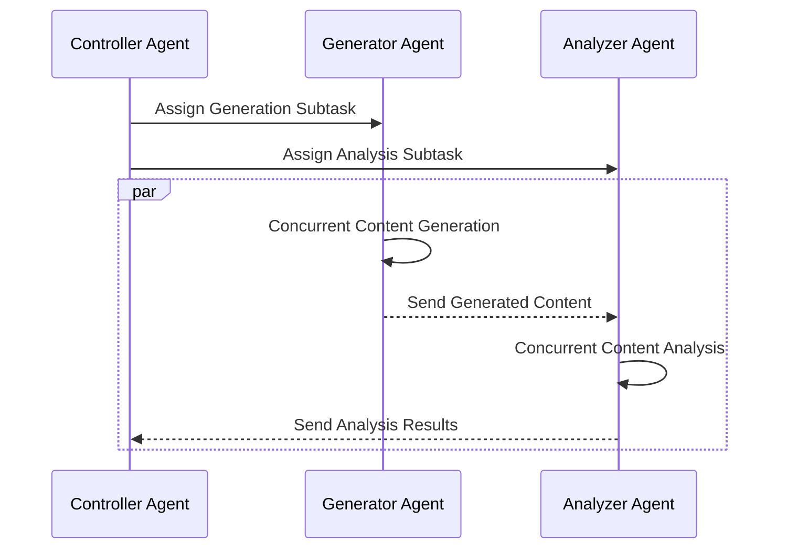
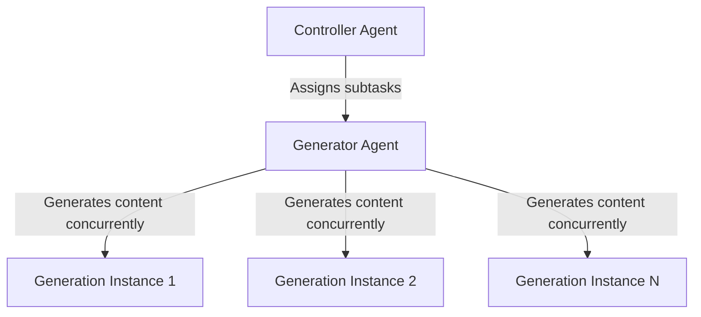
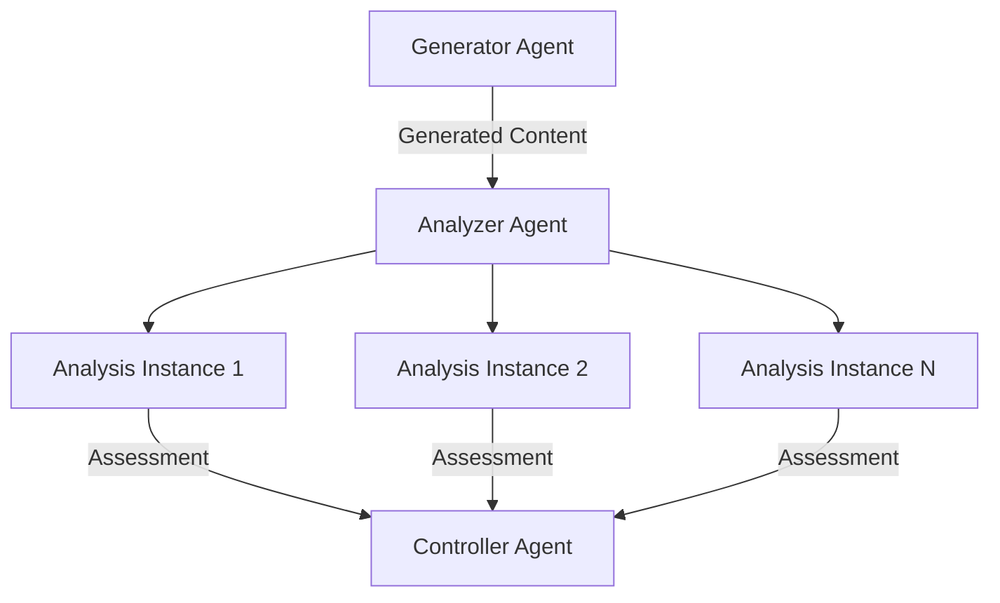
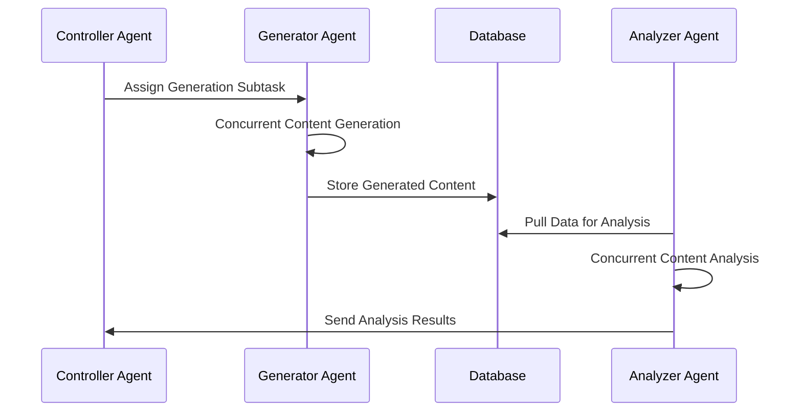

# Harnessing Hierarchical Swarms: A Groundbreaking Approach to Multi-Modal Content Creation

## Introduction:
In an age dominated by information, the ability to not only comprehend but also create and analyze content across multiple modalities has become the cornerstone of artificial general intelligence (AGI). In this innovative domain, researchers have made significant strides, leveraging the power of specialized agents that work in unison to produce and scrutinize content with remarkable efficiency.

In this exploration of artificial intelligence's frontier, we transcend beyond the established norms found in current literature[1][2]—which predominantly delve into conversational agents of a singular nature or hierarchical swarms lacking concurrency and multi-modality. Our work emerges as a trailblazing model, pioneering the enhancement of OPENAI's assistants/agents by fusing the power of multi-modality with the dynamism of concurrent generation and analytical processes.

The weight of our contributions is marked by several notable advancements:

- We inaugurate a concurrency model within our agents' hierarchical structure, vastly improving their ability to generate and analyze content simultaneously. This pivotal move yields a nimbler content production cycle, maintaining high-quality standards while achieving unprecedented speeds.
- The Controller Agent is equipped with a deftly crafted task decomposition scheme, ensuring tasks are delicately segmented and efficiently distributed. This results in a significant reduction in overall processing time—a leap forward in task management.
- A cornerstone of our framework is the development of seamless communication protocols among agents. These protocols ensure essential information exchange for their collaborative tasks, simultaneously nurturing a learning environment that enhances the system's sophistication over iterations.
- We have realized a strategy encompassing the duality of generation and analysis, tapping into the agents' inherent concurrent analytical capabilities. This multitasking philosophy promotes the parallel processing of diverse content, bolstering output volume while sharpening the analytical acuity cycle after cycle.
- Crucially, we demonstrate the framework's adeptness in multi-modal environments, particularly underscored in its image generation and analysis capabilities. This proof of concept solidifies the framework's adaptability and sets the stage for it to be custom-tailored to an array of computational arenas.

With these reflections in mind, let us delve into the mechanics and promise that this novel framework brings to the vast landscape of artificial intelligence.

## The Dawn of the Hierarchical Swarm of Agents:
We present a novel methodology that redefines the boundaries of AGI—a hierarchical swarm of agents adept at concurrent content generation and analysis. This trio of specialized agents transforms the AGI landscape by breaking down complex tasks into more manageable subtasks. Let's take a closer look at these pioneering agents:
Controller Agent - The maestro of task decomposition, ensuring a seamless division of labor between generation and analysis.
Generator Agent - A virtual artisan, conjuring content from the void in multiple forms simultaneously, from the written word to the visual spectacle.
Analyzer Agent - An astute critic, it provides invaluable, real-time feedback, ensuring the content not only exists but excels in quality.

### The Mechanics of Genius — How the Agents Interact:
The core of our framework is a well-orchestrated interaction model, as depicted by the following diagram:



This sequence diagram illustrates how the Controller Agent directs the Generator and Analyzer Agents. It shows task assignment and the parallel nature of content generation and analysis.

### Concurrent Generation and Analysis — The Road to Efficiency:
The very soul of this innovative architecture lies in its ability to create and analyze content concurrently, ensuring that no time is wasted and every potential is harnessed. We visualize this streamlined process with two diagrams.

#### For Generation:


This flowchart describes how content generation is managed concurrently. Starting with task assignment by the Controller Agent to multiple independent generation instances.

#### For Analysis:


This flowchart demonstrates the content analysis process, showing how the Analyzer Agent assesses each content instance and then reports back to the Controller Agent.

#### Python Code for the Entire Process
Below we present the gateway to initiating our proposed framework's swarm of multi-modal concurrent generative-analytic agents. For an extensive explanation of each module's implementation within the provided code snippet, we direct you to the dedicated GitHub repository link in [3].

```python
import json
import os
import threading

from agent_funcs import img_file_analyzer, img_generator
from agent_loop import agent_loop, agent_loop_anlys_with_func, agent_loop_gen_with_func
from agents_build import agent_builder
from agents_swarm import (
    analyzer_agent_with_threading_swarm,
    controller_agent_with_threading_swarm,
    generator_agent_with_threading_swarm,
)
from communication import ThreadCommunication
from configs import parse_kwargs
from shared_components import create_client


def main():
    comm = ThreadCommunication()
    shutdown_event = threading.Event()

    params = parse_kwargs()

    client = create_client()

    # Make directories to save generation and analysis outputs
    try:
        os.makedirs("data/generation")
        os.makedirs("data/analysis")
    except FileExistsError:
        # directory already exists
        pass

    agents_ids_dir_name = "agents_build/ids/"
    agents_ids_file_name = "agent_ids.json"

    try:
        os.makedirs(agents_ids_dir_name)
    except FileExistsError:
        # directory already exists
        pass

    file_path = os.path.join(agents_ids_dir_name, agents_ids_file_name)

    agents_ids_json = []

    if os.path.exists(file_path):
        with open(file_path, "r") as f:
            agents_ids = json.load(f)

            cont_agent_id = agents_ids[0]["controller"]
            gen_agent_id = agents_ids[1]["generator"]
            anlys_agent_id = agents_ids[2]["analyzer"]
    else:
        _, agent_cont = agent_builder(
            client,
            params["sys_prompt_cont"],
            params["num_cont_agent"],
            **params["params_cont"],
        )

        cont_agent_id = agent_cont.id

        _, agent_gen = agent_builder(
            client,
            params["sys_prompt_gen"],
            params["num_gen_agent"],
            **params["params_gen"],
        )

        gen_agent_id = agent_gen.id

        _, agent_anlys = agent_builder(
            client,
            params["sys_prompt_anlys"],
            params["num_anlys_agent"],
            **params["params_anlys"],
        )

        anlys_agent_id = agent_anlys.id

        with open(file_path, "w") as file:
            agents_ids_json.append({"controller": cont_agent_id})
            agents_ids_json.append({"generator": gen_agent_id})
            agents_ids_json.append({"analyzer": anlys_agent_id})

            json.dump(agents_ids_json, file)

    # Unify function arguments
    generator_fn = img_generator
    analyzer_fn = img_file_analyzer

    # Create threads
    controller_thread = threading.Thread(
        target=controller_agent_with_threading_swarm,
        args=(
            client,
            cont_agent_id,
            params["subject"],
            params["file_names"],
            shutdown_event,
            params["thread_count_gen"],
            comm,
            params["cont_time_out"],
            agent_loop,
        ),
        name="Communication-Thread-Controller",
    )

    generator_threads = [
        threading.Thread(
            target=generator_agent_with_threading_swarm,
            args=(
                client,
                gen_agent_id,
                comm,
                params["gen_time_out"],
                shutdown_event,
                generator_fn,
                agent_loop_gen_with_func,
            ),
            name=f"Communication-Thread-Generator-{i}",
        )
        for i in range(params["thread_count_gen"])
    ]

    analyzer_threads = [
        threading.Thread(
            target=analyzer_agent_with_threading_swarm,
            args=(
                client,
                anlys_agent_id,
                comm,
                params["anlys_time_out"],
                shutdown_event,
                analyzer_fn,
                agent_loop_anlys_with_func,
            ),
            name=f"Communication-Thread-Analyzer-{i}",
        )
        for i in range(params["thread_count_anlys"])
    ]

    # Start threads
    controller_thread.start()

    for generator_thread in generator_threads:
        generator_thread.start()

    for analyzer_thread in analyzer_threads:
        analyzer_thread.start()

    # Wait for threads to finish
    controller_thread.join()

    for generator_thread in generator_threads:
        generator_thread.join()

    for analyzer_thread in analyzer_threads:
        analyzer_thread.join()

    # All threads have completed their tasks
    print("All tasks completed.")


if __name__ == "__main__":
    main()
```

The Python code snippet above elegantly encapsulates the essence of our framework's parallel agent architecture. At its core, the script orchestrates the creation, management, and coordination of the three pivotal agents: the Controller, Generator, and Analyzer Agents, all choreographed to operate concurrently using threading.
##### Initial Setup and Communication Channel:
The script begins by establishing a communication medium (ThreadCommunication) and a shutdown event to manage thread lifecycle. It peeks into the configuration parameters that dictate the system's behavior and sets up the required directories for data storage, keeping generated and analyzed outputs organized.
##### Agent Identification and Creation:
It ensures the agents are correctly identified, initializing new ones if necessary, using identifiers stored in 'agent_ids.json'. Each agent is constructed with specific prompts and parameters, allocated with unique responsibilities and identifiers.
##### Concurrent Execution with Threading:
We leverage Python's threading module to breathe life into our agents. The controller agent's thread oversees task delegation, while multiple generator and analyzer threads work on content creation and evaluation tasks simultaneously.
##### Efficient Task Management:
The generator threads utilize the img_generator function to produce content. In tandem, the analyzer threads apply img_file_analyzer to assess the content. Communication between threads through the shared medium dictating the workflow.
##### Python Implementation of Diagram Concepts:
This implementation brings to reality the concepts described in our earlier diagrams. As the Controller Agent directs traffic, the Generator and Analyzer Agents perform their roles in a symphony of concurrent operations, just as our theoretical model prescribes.
##### Graceful Termination and Output:
Upon completion of the assigned tasks, threads are joined back to the main thread, ensuring an orderly shutdown and signaling the successful end of all operations. By using multi-threading, we manifest the theoretical prowess of our framework, proving its capability to revolutionize how AI systems can handle complex, multi-modal tasks with agility and precision.

### A Glimpse into the Future — Extending the Workflow:
To increase robustness and scalability, we also propose an enhanced workflow that includes a central database, illustrated by this sequence diagram:



This sequence diagram expands on the interaction model by incorporating a central database, illustrating data storage and retrieval for content generation and analysis.

## Empirical Evidence of Superiority:
In testing our proposed hierarchical swarm of agents against the solitary use of "dall-e-3" for image generation, our framework not only improved the turnaround time but also significantly enhanced the coherence between generated images and their textual descriptors.

In particular, our method demonstrated remarkable results in the realm of concurrent image generation and analysis, exceeding all predefined criteria with a superior average score compared to traditional benchmarks. To put this into context, our innovative approach achieved an impressive average score of 9.3 out of 10, while the baseline system reached only 8.2 out of 10. This was particularly evident in our task to create a visually rich depiction of "A futuristic cityscape," complete with flying cars and towering skyscrapers adorned with holographic ads. For those curious to delve deeper into the generated content's specifics and the particular scores assigned to each requirement, we invite you to explore the detailed report available via the corresponding GitHub link provided in this blog.

## Conclusion:
As we stand at the precipice of this AGI revolution, our hierarchical swarm of agents shines as a beacon, promising efficiency, adaptability, and a new era of creativity in multi-modal AGI. This methodology does not simply improve upon the present; it paves the way for a future where AGI systems will handle dynamic and multi-faceted content with a finesse beyond our current ken.

## Final Thoughts:
Through our extensive research and experimentation, we invite you to embark on a journey of discovery and progress in the AGI domain. This is AGI unwrapped, a realm where creation and analysis merge seamlessly, heralding a future rich with potential and brimming with intelligence.

## Author's Note:
I would like to acknowledge the use of OpenAI's GPT-4 model in the drafting of this blog post. The insights and written content presented here were enhanced by AI, which assisted with preliminary drafts and the generation of certain descriptive elements. This collaboration with AI technology was conducted under careful authorial oversight to ensure the scientific accuracy and integrity of all information. The final composition, content curation, and critical analysis remain the intellectual endeavor of the author.

## References
[1]: Q. Wu, G. Bansal, J. Zhang, Y. Wu, B. Li, E. Zhu, L. Jiang, X. Zhang, S. Zhang, J. Liu, A.H. Awadallah, R.W. White,  D. Burger, and C. Wang, AutoGen: Enabling Next-Gen LLM Applications via Multi-Agent Conversation, arXiv preprint arXiv: 2308.08155, 2023. 

[2]: D. Shapiro, Hierarchical Autonomous Agent Swarm (HAAS), 
https://github.com/daveshap/OpenAI_Agent_Swarm.git, 2023.

[3]: A. Shahmansoori, Concurrent Generative-Analytic Swarms: A Hierarchical Agent-Based Approach for Efficient Multi-Modal Synthesis and Assessment, https://github.com/arash-shahmansoori/multi_modal_agents_swarm.git, 2024.

https://medium.com/@arash.mansoori65/harnessing-hierarchical-swarms-a-groundbreaking-approach-to-multi-modal-content-creation-061dbcb698f6
